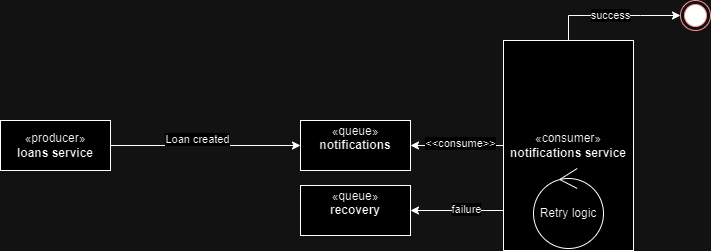

# Microservices Architecture Prototype with Queue Communication

This is a walking skeleton of a microservices architecture asynchronously connected via queues. The objective is to prototype such architectures as an exploration phase, testing, and with the aim of discovering their advantages, disadvantages, and any associated risks.

The solution consists of the following components:

- Loans service:
    This service is the "producer"; after creating a loan, it generates an event to notify this.

- Notifications service:
    This service is the "consumer" responsible for notifications and raises the event of creating a loan.
    It has a retry mechanism that attempts 3 times or until the message expires (TTL), whichever comes first.
    Messages that cannot be processed after retries go to the "dead letter" queue.

- Recovery service:
    This service is not fully implemented but it is responsible for raising the "dead letter" queue. The idea of this would be to process messages that could not be handled, either by reprocessing them or with some manual review depending on the case.

- Common library:
    Contains queue events (patterns), the payload interface, and configuration options for the 2 queues used, which are shared among the different microservices.

- Queues:
  - notifications: is the queue that handles notification messages
  - recovery: is the queue for messages that could not be notified after the retry strategy and/or the specified time to live (dead-letter queue)

- Events:
  - CREATE_NOTIFICATION_PATTERN: is the event consumed by the notifications service to generate notifications
  - NOTIFICATION_SUCCESS_PATTERN: event to inform that the notification was successfully made
  - NOTIFICATION_FAILURE_PATTERN: event to inform that the notification and its retries failed (message dropped)



**Note:** The service names are for example purposes only as this solution is a walking skeleton and therefore does not possess domain logic.

## Architecture Decisions

In implementing this prototype, it was decided to use RabbitMQ as the queue manager over Bull. This decision is documented in the included ADR under the name **Queue-Management-02-12-2023.md**. The quality attributes considered for this decision were as follows:

- Interoperability
- Scalability and Performance
- Flexibility / Extensibility
- Robustness / Support

## Test Scenarios

To test the architecture, two endpoints were created in the loans service:

- /POST /api which creates a Loan and passes a type in the body to test different scenarios. If the type is "sms", the notifications service will fail; with any other type, it will be successful.
- POST /api/batch creates a number of Loans n (as indicated in the body), 1 out of every 5 loans created will be of type "sms".

## Advantages of Using Microservices

**Scalability and Flexibility:** Microservices allow scaling specific components independently, facilitating load management and adaptation to changes in demand.

**Independent Deployment:** Each microservice can be deployed independently, speeding up updates and reducing the impact of errors on other services.

**Diverse Technology:** They facilitate the adoption of different technologies and programming languages for each service, allowing the selection of the best tool for each task.

**Facilitate Independent Team Work:** By being divided into smaller services, multiple teams can work in parallel on different microservices, improving the ability to develop at scale, independently.

## Disadvantages of Using Microservices

**Management Complexity:** Managing multiple services increases the initial implementation effort as it involves developing means of communication and coordination between them and greater effort for monitoring and administration, increasing operational complexity.

**Consistency and Coherence Issues:** Managing transactions and data consistency between microservices can be challenging, leading to consistency problems in distributed systems.

**Increased Latency:** Communications between microservices have additional latency compared to monolithic applications.

**Implementation and Maintenance Costs:** Adopting microservices implies a change in architecture and may require significant investments in infrastructure and resources for development and maintenance.

## Advantages of Using Queues for Microservices Communication

**Decoupling:** Queues allow services to be decoupled, meaning a service does not need to directly know the other service to which it sends information. This facilitates scalability and independent evolution of services.

**Fault Tolerance:** Queues can help handle situations where a service is temporarily inactive or experiencing technical issues, as messages can be stored in the queue until the destination service is ready to process them.

**Performance Improvement:** By allowing asynchronous processing, queues can improve performance by freeing up resources and allowing services to process messages at their own time and capacity.

## Disadvantages of Using Queues for Microservices Communication

**Additional Complexity:** They introduce complexity in the architecture, as logic for sending, receiving, and managing messages in queues needs to be implemented and managed.

**Potential Message Loss:** There is a risk of message loss if adequate mechanisms are not implemented to handle them in case of failures in the queue or services.

**Additional Latency:** The use of queues can introduce additional latency compared to direct communications between services, especially in environments where an immediate response is required.

**State Management Complexity:** Maintaining the proper state in a queue-based system can be challenging, as it may require special techniques to ensure data coherence and consistency.

In summary, using queues for communication between microservices offers significant benefits in terms of decoupling and fault tolerance but also introduces additional complexity that must be managed and considered in the design and implementation of the system.

## Conclusions

The adoption of a microservices architecture using queues allows scaling specific components independently, optimizing resources and responsiveness. The separation into smaller services reduces the impact of failures since issues in one microservice do not necessarily affect the entire system.

Microservices can be managed by different small teams. A person joining the project has a shorter learning curve since they only need to understand one microservice and not the entire solution as would be the case with a monolith.

The use of microservices and RabbitMQ, which implements the AMPQ protocol, allows for the future choice of different technologies for each microservice.

The development of this prototype allows us to see some of the challenges that can be encountered when using this architecture. In particular, it explores a simple retry pattern that could be improved in the future by using an exponential backoff strategy, for example. It also uses an expiration time (TTL: time to live) and a maximum number of retries along with a queue to persist dropped messages (dead-letter queue), which allows cutting the retry cycle to avoid overloading the system. This could also be improved by implementing a more sophisticated circuit breaker pattern and also an automatic, manual, or mixed recovery implementation as needed to handle dropped messages.

All of this implies that implementing this type of solution requires a **greater initial effort** (ramp-up). Among other things, in terms of queue management and configuration, message handling, retry and drop strategies, etc. But this larger initial cost will result in greater reliability and resilience of the solution as a whole and later in the product lifecycle will allow faster and more frequent updates and deployments, facilitating continuous delivery of value.

Some of the challenges that were not explored in this prototype but may be encountered include monitoring and debugging interactions between multiple microservices, increasing operational complexity. As well as maintaining consistency among them, especially in distributed transactions that require atomicity.

Some of the risks identified are that communication between microservices via queues can generate an excess of messages and network overhead, as well as message loss and duplication.

In conclusion, a microservices architecture using queues offers significant benefits in terms of scalability, flexibility, and resilience but entails considerable challenges in terms of operational complexity, latency, transaction management, and maintaining consistency. Successful implementation requires careful design and effective management of associated risks.

## Instructions to Run the Prototype

### Prerequisites

- Node v20 (and npm)
  - It can be downloaded from https://nodejs.org/en/download
  - Or use a package manager like nvm: https://nodejs.org/en/download/package-manager
- Docker

### RabbitMQ

Download a Dockerized instance of RabbitMQ

```bash
docker pull rabbitmq:3-management-alpine
```
```bash
docker run -e RABBITMQ_DEFAULT_USER=admin -e RABBITMQ_DEFAULT_PASS=admin --rm -it -p 15672:15672 -p 5672:5672 rabbitmq:3-management-alpine
```

### Configuration

Set the configuration values in the .env files in the root of each service:

- `path-to-app\event_driven_arch\apps\loans-service\.env`
- `path-to-app\event_driven_arch\apps\notifications-service\.env`
- `path-to-app\event_driven_arch\apps\recovery-service\.env`

The default values are in the `env.template` file in each of those directories. If the values used are as they are in this text, simply renaming each of these files to `.env` will suffice.

### Install Dependencies

- Run `npm i` in the root of the workspace `path-to-app\event_driven_arch\`

### Run the Services

- To run the loans service, execute in one console `npx nx serve loans-service`

- To run the notifications service, execute in another console `npx nx serve notifications-service`

- To run the recovery service (which raises the dead-letter queue), execute in another console `npx nx serve recovery-service`

Note: To install Nx globally: `npm install --global nx@latest` (so you don't have to use npx in every command)

### Testing from the REST API

Generate a loan with successful notification:

```bash
curl --location 'http://localhost:3000/api/' \
--header 'Content-Type: application/json' \
--data '{
    "type": "email"
}'
```

Generate a loan with failed notification:

```bash
curl --location 'http://localhost:3000/api/' \
--header 'Content-Type: application/json' \
--data '{
    "type": "sms"
}'
```

Generate a batch of n loans, 1 out of every 5 fails

```bash
curl --location 'http://localhost:3000/api/batch' \
--header 'Content-Type: application/json' \
--data '{
    "quantity": 30
}'
```

Activity generated for each of the services can be observed in their respective consoles.
